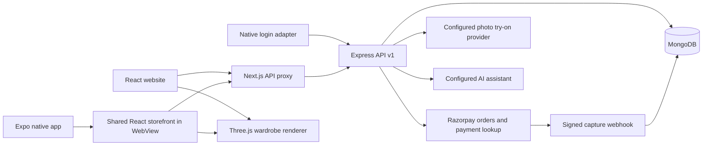

# CODED FIT: current implementation and production architecture

## What was found

The repository contained a standalone HTML site, an unfinished Next.js React frontend, Express/Mongoose APIs, and a separate Expo app. The three implementations did not share consistent catalog IDs, cart totals, authentication or checkout behavior. Web checkout submitted invented payment IDs/signatures; mobile accepted arbitrary credentials and recorded local-only orders as confirmed. Several order operations lacked ownership checks. The API served the repository root, the OTP adapter accepted arbitrary codes, and the seed script deleted data and created a known admin password and a fake paid order.

The migration builds on the existing React code rather than flattening HTML into React wrappers. Old pages and scripts are retained in `frontend/legacy` for reference and are not served. Previous native screens are in `mobile-app/legacy` and excluded from TypeScript compilation.

## Repository

```text
frontend/
  app/                  Next.js App Router pages (React + TypeScript)
  components/           Store, auth, checkout, wardrobe and body preview
  services/api.ts       API v1 client
  store/                Zustand cart, session, body and customization state
  shared/               Domain types and design tokens
  public/               Public images/video only
  legacy/               Archived HTML/CSS/JavaScript
  docs/                 This architecture and asset requirements
backend/
  routes/               Versioned API and compatibility routes
  controllers/          Auth, products, orders, checkout, webhook and admin
  services/             Provider adapters and server customization pricing
  models/               MongoDB models including persistent saved designs
  middleware/           JWT auth, administrator guards, limits and errors
  tests/                Security tests and isolated MongoDB integration tests
mobile-app/
  app/                  Expo Router navigation
  components/Storefront.tsx  Shared web storefront hosted inside native WebView
  services/             Native API adapter; legacy native services retained
  legacy/               Previous independent screens
```

## Runtime flow



The app currently uses a **hybrid WebView architecture**, not a complete rewrite of every screen into native React Native. Commerce, measurements, wardrobe, try-on, account and orders use the same React implementation and persistent web session. This avoids divergent client-side prices and fake mobile checkout. Native login is now backed by the API, but its token is separate from the web session; sign in inside the shared storefront for shopping. A future fully native implementation should use secure device storage and the same API contracts.

## Authentication and customer data

Email registration hashes passwords through the existing user model; sign-in issues JWTs. The React client restores sessions by verifying the saved token with `/auth/me`. Order lookup, feedback, reorder, production tracking, payment intents and verification require authentication and ownership. Admin APIs enforce the administrator role on the server. The web token still uses localStorage; moving it to an HttpOnly secure cookie with CSRF protection is a prelaunch improvement.

Development OTPs are one-use, expire, and have a bounded verification attempt count. The universal development code was removed. **Production SMS is not implemented**: it fails instead of claiming to verify an arbitrary code. Use email login until a real SMS provider is integrated.

## Catalog → cart → payment → order

1. Storefront and product pages load the database catalog. Unknown products show a missing-product state.
2. Cart persists on the device. Items preserve size, color and full customization identity.
3. Authenticated checkout creates an unpaid order. The server looks up products, validates sizes/quantities/availability, and ignores submitted prices and payment status.
4. Custom prices use the database fabric surcharge and validated design options. Monogram/collar additions are calculated by the server. The approved design fields are stored with the order.
5. The payment intent uses the stored order total and is bound to the customer order, never a client-supplied amount.
6. Razorpay Checkout returns its actual IDs/signature. The server validates the bound order signature and fetches the payment to check captured status, currency and amount.
7. A signed `payment.captured` webhook can confirm payment if the browser closes. Repeated notifications do not create another order or repeat a paid-state transition.
8. The cart clears only after successful verification. Cancelled/failed payments keep the cart; the pending order is reused within the mounted checkout page.

The current shipping rule is ₹150 below ₹2,999 and free at or above it; NOVA10 is the supported coupon. Additional tax is currently zero. Configure business-approved tax, delivery, discounts, returns and invoicing before opening the store. This document does not validate the appropriate tax treatment.

## Game-style wardrobe and realistic assets

The Three.js scene provides orbit, zoom, auto-rotate/pause, reset, skin tone, two poses, garment-specific geometry, color, fit proportions and monogram preview. Measurements affect the procedural preview. Outfits can be saved to the signed-in account and restored. GLB imports support named garment materials and `chest`/`waist` morph targets. Model imports remain local to the preview and are not uploaded.

**The bundled character remains a procedural illustration, not a photoreal person, body scan, cloth simulation, or GTA character.** No Rockstar game assets are included. GTA-style interaction means a character editor and wardrobe workflow; real visual fidelity requires an authored asset pipeline described in `ASSETS.md`.

Real-person photo try-on sends a consented photo plus a selected product image to the configured provider. The client payload and polling response were aligned, file validation added, and camera tracks cleaned up. The inherited YouCam adapter has not been verified against a live service/account. Provider availability is reported rather than returning a fake image or invented fit score.

## Deployment target and remaining release gates

Host the Next.js frontend on a Node-compatible service with HTTPS. Run Express separately behind HTTPS, configure allowed `CLIENT_URL` origins, use managed MongoDB, and keep payment/AI secrets only on the backend. Set mobile `EXPO_PUBLIC_WEB_URL` to the deployed frontend. Configure the Razorpay webhook URL and independent webhook secret.

Before a real launch:

- Add transactional stock reservations, reservation expiry and reconciliation. Current stock validation does **not** prevent concurrent checkout overselling or decrement inventory on payment.
- Implement payment recovery for stale `creating` intent locks, order idempotency across reloads, refund workflows and payment reconciliation alerts.
- Test real Razorpay test-mode checkout, capture, webhook delivery, cancellations and retry behavior. The supplied credentials contain placeholders; no money was charged in verification.
- Verify or replace the photo try-on provider adapter, add persistent job queues, private object storage, retention/deletion controls and authenticated task ownership.
- Add production SMS/email verification, password reset, secure cookie/native token storage and operational abuse monitoring.
- Complete returns, shipping label/tracking integrations, invoices, product/variant inventory management and production-status transition rules. Return submission currently returns unavailable instead of a fake ticket.
- Supply licensed product photography and realistic human/garment assets. Validate fabric, delivery, certification and marketing claims against actual business operations.
- Test Android/iOS WebGL, camera permissions, keyboard/navigation, accessibility and Razorpay/UPI redirects on real devices. Build signed APK/AAB/IPA artifacts separately.
- Add CI, backups, logs with redaction, error reporting, performance budgets and load tests.

## Verification completed

- Next.js production build and frontend TypeScript check.
- Mobile TypeScript check after Expo regenerated route types.
- MongoDB-backed tests in a uniquely named temporary database: registration, failed login, server pricing, invalid quantities, ownership, private saved designs, custom surcharges, fake payment rejection, payment binding/capture and replay, signed webhook/replay.
- Separate signature and OTP tests. Payment provider network responses are stubbed in tests; these are not live gateway acceptance tests.
- Local API startup with MongoDB and browser inspection of garment/color switching and the studio controls.

The local application is reviewable and runnable; it is not certified production-ready or photoreal-complete.

References: [Three.js GLTFLoader](https://threejs.org/docs/pages/GLTFLoader.html), [OrbitControls](https://threejs.org/docs/pages/OrbitControls.html), [Razorpay signature verification](https://github.com/razorpay/razorpay-node/blob/master/documents/paymentVerfication.md).
